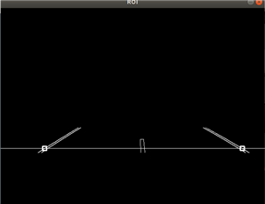

# Programmers-Dev Auto-pilot 

## Final video

## Goal
* Drive 3 laps without getting out of the road.

## Procedure

### Image processing & lane detection

* Used Gaussian blur to reduce image noise.
* Used Canny edge detection to detect lanes.
* Used more reliable lane to decide less reliable lane.(By adding or subtracting the width of the road)
* Used moving average filter to reduce noise.
  

### Control
* Used P-control to reduce the center of the camera image and the center of the road.
* When there are straight lane above certain height in the image, We considered the lane as a straight and long one.
* So when the car figured out the lane is straight and long, we modeled car to accelerate.

### SImulation with Ros bag file
* Using Ros bag file, I tested my auto-pilot algorithm.  

## Limitations
* We've made a car to accelerate at straight lane, but sometimes it made car to get out of the road.
* The track was composed in two lanes, and car was too big for to drive in a lane.
* So we had to use two lane which was harder than using just a lane because of the center line.

## What I've learned
* How to use a Ros and use sensors and actuators using Ros.
* Basic concepts of a steering.
* How to work on a project in Ubuntu env.
* Got more familiar with Ubuntu.

